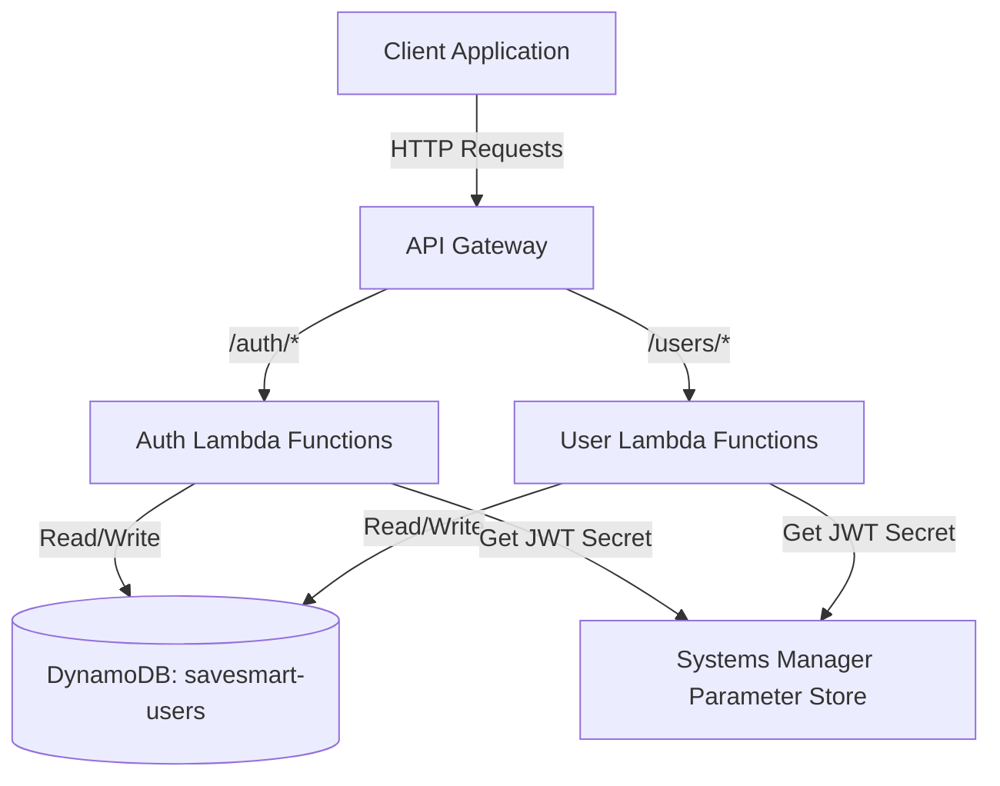
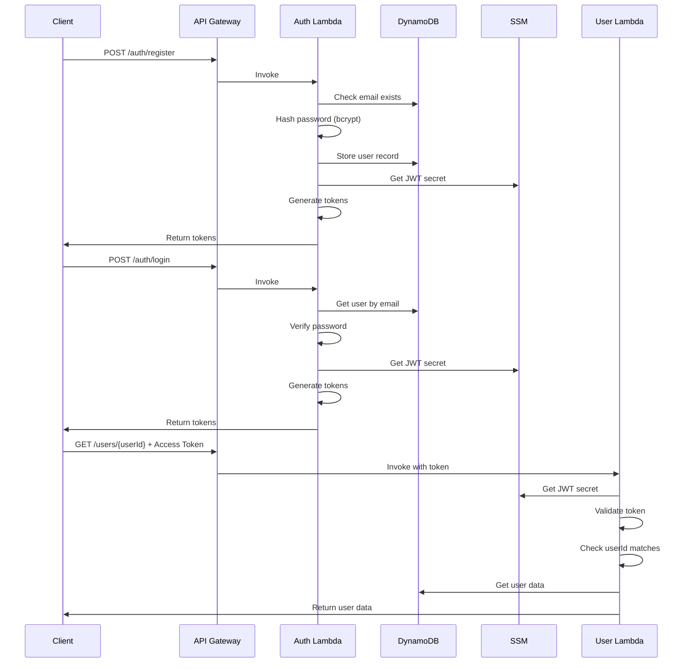

# Design Document: Backend Authentication

## Overview

This design implements JWT-based authentication for the SaveSmart serverless backend. The system will provide user registration, login, token management, and password reset functionality while securing existing user management endpoints. The implementation uses AWS Lambda functions, API Gateway, DynamoDB for user storage, and AWS Systems Manager Parameter Store for secret management.

The authentication flow follows industry-standard practices:
- Passwords are hashed using bcrypt before storage
- JWT tokens provide stateless authentication
- Access tokens are short-lived (1 hour) for security
- Refresh tokens are long-lived (7 days) for user convenience
- Protected endpoints validate tokens before processing requests

## Architecture

### High-Level Architecture



### Authentication Flow



## Components and Interfaces

### Lambda Functions

#### 1. Auth Handler Lambda

**Purpose:** Handles all authentication-related operations

**Endpoints:**
- `POST /auth/register` - User registration
- `POST /auth/login` - User login
- `POST /auth/refresh` - Token refresh
- `POST /auth/reset-request` - Password reset request
- `POST /auth/reset-complete` - Password reset completion

**Handler Structure:**
```javascript
exports.handler = async (event) => {
  const route = event.routeKey;

  switch (route) {
    case 'POST /auth/register':
      return handleRegister(event);
    case 'POST /auth/login':
      return handleLogin(event);
    case 'POST /auth/refresh':
      return handleRefresh(event);
    case 'POST /auth/reset-request':
      return handleResetRequest(event);
    case 'POST /auth/reset-complete':
      return handleResetComplete(event);
    default:
      return { statusCode: 404, body: JSON.stringify({ error: 'Not found' }) };
  }
};
```

#### 2. User Handler Lambda (Modified)

**Purpose:** Handles user management operations with authentication

**Endpoints:**
- `GET /users/{userId}` - Get user data (protected)
- `PUT /users/{userId}` - Update user data (protected)

**Authentication Middleware:**
```javascript
async function validateToken(event) {
  const token = extractTokenFromHeader(event.headers);
  if (!token) {
    throw new Error('No token provided');
  }

  const secret = await getJWTSecret();
  const decoded = jwt.verify(token, secret);

  if (decoded.type !== 'access') {
    throw new Error('Invalid token type');
  }

  return decoded;
}
```

### Core Modules

#### 1. Token Service

**Responsibilities:**
- Generate JWT access tokens
- Generate JWT refresh tokens
- Validate token signatures
- Extract token payloads

**Interface:**
```javascript
class TokenService {
  constructor(secret) {
    this.secret = secret;
  }

  generateAccessToken(userId, email) {
    // Returns JWT with 1 hour expiration
  }

  generateRefreshToken(userId) {
    // Returns JWT with 7 day expiration
  }

  validateToken(token) {
    // Returns decoded payload or throws error
  }

  extractUserId(token) {
    // Returns userId from token payload
  }
}
```

#### 2. Password Service

**Responsibilities:**
- Hash passwords using bcrypt
- Verify passwords against hashes
- Validate password requirements

**Interface:**
```javascript
class PasswordService {
  async hashPassword(plainPassword) {
    // Returns bcrypt hash with salt rounds = 10
  }

  async verifyPassword(plainPassword, hashedPassword) {
    // Returns boolean
  }

  validatePasswordRequirements(password) {
    // Returns { valid: boolean, errors: string[] }
  }
}
```

#### 3. User Repository

**Responsibilities:**
- CRUD operations on DynamoDB user table
- Email lookups via GSI
- Reset token management

**Interface:**
```javascript
class UserRepository {
  constructor(tableName, dynamoClient) {
    this.tableName = tableName;
    this.dynamoClient = dynamoClient;
  }

  async createUser(userId, email, hashedPassword) {
    // Creates user record
  }

  async getUserById(userId) {
    // Returns user or null
  }

  async getUserByEmail(email) {
    // Returns user or null (uses GSI)
  }

  async updatePassword(userId, hashedPassword) {
    // Updates password field
  }

  async setResetToken(userId, tokenHash, expiry) {
    // Sets reset token and expiry
  }

  async clearResetToken(userId) {
    // Clears reset token fields
  }
}
```

#### 4. Validation Service

**Responsibilities:**
- Validate email format
- Validate password requirements
- Validate request payloads

**Interface:**
```javascript
class ValidationService {
  validateEmail(email) {
    // Returns boolean
  }

  validatePassword(password) {
    // Returns { valid: boolean, errors: string[] }
  }

  validateRegistrationPayload(body) {
    // Returns { valid: boolean, errors: string[] }
  }

  validateLoginPayload(body) {
    // Returns { valid: boolean, errors: string[] }
  }
}
```

## Data Models

### DynamoDB Table: savesmart-users

**Table Configuration:**
- Table Name: `savesmart-users`
- Partition Key: `userId` (String)
- Global Secondary Index: `email-index`
  - Partition Key: `email` (String)

**User Record Schema:**
```javascript
{
  userId: String,        // UUID v4, partition key
  email: String,         // User email, indexed via GSI
  hashedPassword: String, // Bcrypt hash
  createdAt: String,     // ISO 8601 timestamp
  resetToken: String,    // Optional, bcrypt hash of reset token
  resetTokenExpiry: String // Optional, ISO 8601 timestamp
}
```

**Example User Record:**
```json
{
  "userId": "550e8400-e29b-41d4-a716-446655440000",
  "email": "user@example.com",
  "hashedPassword": "$2b$10$N9qo8uLOickgx2ZMRZoMyeIjZAgcfl7p92ldGxad68LJZdL17lhWy",
  "createdAt": "2024-01-15T10:30:00.000Z"
}
```

### JWT Token Payloads

**Access Token:**
```json
{
  "userId": "550e8400-e29b-41d4-a716-446655440000",
  "email": "user@example.com",
  "type": "access",
  "iat": 1705315800,
  "exp": 1705319400
}
```

**Refresh Token:**
```json
{
  "userId": "550e8400-e29b-41d4-a716-446655440000",
  "type": "refresh",
  "iat": 1705315800,
  "exp": 1705920600
}
```

### API Request/Response Models

**Registration Request:**
```json
{
  "email": "user@example.com",
  "password": "SecurePass123"
}
```

**Registration Response:**
```json
{
  "userId": "550e8400-e29b-41d4-a716-446655440000",
  "email": "user@example.com",
  "accessToken": "eyJhbGciOiJIUzI1NiIsInR5cCI6IkpXVCJ9...",
  "refreshToken": "eyJhbGciOiJIUzI1NiIsInR5cCI6IkpXVCJ9..."
}
```

**Login Request:**
```json
{
  "email": "user@example.com",
  "password": "SecurePass123"
}
```

**Login Response:**
```json
{
  "userId": "550e8400-e29b-41d4-a716-446655440000",
  "email": "user@example.com",
  "accessToken": "eyJhbGciOiJIUzI1NiIsInR5cCI6IkpXVCJ9...",
  "refreshToken": "eyJhbGciOiJIUzI1NiIsInR5cCI6IkpXVCJ9..."
}
```

**Refresh Request:**
```json
{
  "refreshToken": "eyJhbGciOiJIUzI1NiIsInR5cCI6IkpXVCJ9..."
}
```

**Refresh Response:**
```json
{
  "accessToken": "eyJhbGciOiJIUzI1NiIsInR5cCI6IkpXVCJ9...",
  "refreshToken": "eyJhbGciOiJIUzI1NiIsInR5cCI6IkpXVCJ9..."
}
```

**Password Reset Request:**
```json
{
  "email": "user@example.com"
}
```

**Password Reset Request Response:**
```json
{
  "message": "If the email exists, a reset token has been generated",
  "resetToken": "a1b2c3d4-e5f6-7890-abcd-ef1234567890"
}
```

**Password Reset Complete Request:**
```json
{
  "resetToken": "a1b2c3d4-e5f6-7890-abcd-ef1234567890",
  "newPassword": "NewSecurePass123"
}
```

**Password Reset Complete Response:**
```json
{
  "message": "Password reset successful"
}
```

### Environment Variables

**Auth Lambda:**
- `TABLE_NAME`: DynamoDB table name (savesmart-users)
- `JWT_SECRET_PARAM`: SSM parameter name for JWT secret
- `AWS_REGION`: AWS region (ap-southeast-2)

**User Lambda:**
- `TABLE_NAME`: DynamoDB table name (savesmart-users)
- `JWT_SECRET_PARAM`: SSM parameter name for JWT secret
- `AWS_REGION`: AWS region (ap-southeast-2)

### AWS Systems Manager Parameter

**Parameter Name:** `/savesmart/jwt-secret`
**Type:** SecureString
**Value:** Random 256-bit secret (base64 encoded)


## Correctness Properties

A property is a characteristic or behavior that should hold true across all valid executions of a system—essentially, a formal statement about what the system should do. Properties serve as the bridge between human-readable specifications and machine-verifiable correctness guarantees.

### Registration Properties

**Property 1: Email validation**
*For any* registration request, the system should accept only emails that match standard email format (contains @, has domain, valid characters) and reject all other strings.
**Validates: Requirements 1.1**

**Property 2: Password validation**
*For any* registration request, the system should accept only passwords that meet all requirements (minimum 8 characters, at least 1 uppercase letter, at least 1 lowercase letter, at least 1 number) and reject all others with specific error messages.
**Validates: Requirements 1.2**

**Property 3: Duplicate email rejection**
*For any* email that already exists in the system, attempting to register with that email should return an error indicating the email is already registered.
**Validates: Requirements 1.3**

**Property 4: Password hashing on storage**
*For any* successful registration or password reset, the stored password in the database should be a valid bcrypt hash (starts with $2b$, has correct format) and never the plain text password.
**Validates: Requirements 1.4, 7.3**

**Property 5: User record structure**
*For any* successful registration, the created user record should contain all required fields: userId, email, hashedPassword, and createdAt, with correct data types.
**Validates: Requirements 1.5**

**Property 6: Registration response tokens**
*For any* successful registration, the response should contain both a valid accessToken and a valid refreshToken that can be decoded and verified.
**Validates: Requirements 1.6**

### Login Properties

**Property 7: Login with non-existent email**
*For any* email that does not exist in the system, login attempts should fail with an authentication error.
**Validates: Requirements 2.1**

**Property 8: Password verification**
*For any* registered user, login should succeed when the correct password is provided and fail when an incorrect password is provided.
**Validates: Requirements 2.2**

**Property 9: Generic authentication errors**
*For any* failed authentication (invalid email, wrong password, expired token), the error message should be generic and not reveal the specific reason for failure.
**Validates: Requirements 2.3, 6.5, 9.1**

**Property 10: Login response tokens**
*For any* successful login, the response should contain both a valid accessToken and a valid refreshToken with correct expiration times.
**Validates: Requirements 2.4, 2.5, 2.6**

### Token Generation Properties

**Property 11: Access token structure and expiration**
*For any* generated access token, the decoded payload should contain userId, email, and type="access", and the expiration should be exactly 1 hour from the issued-at time.
**Validates: Requirements 3.1, 3.2**

**Property 12: Refresh token structure and expiration**
*For any* generated refresh token, the decoded payload should contain userId and type="refresh", and the expiration should be exactly 7 days from the issued-at time.
**Validates: Requirements 3.3, 3.4**

**Property 13: Token signing with SSM secret**
*For any* generated JWT token, it should be verifiable using the secret key retrieved from AWS Systems Manager Parameter Store, and fail verification with any other key.
**Validates: Requirements 3.5**

**Property 14: JWT algorithm**
*For any* generated JWT token, the decoded header should specify algorithm "HS256".
**Validates: Requirements 3.6**

### Token Validation Properties

**Property 15: Invalid signature rejection**
*For any* token with an invalid signature (tampered payload or signed with wrong key), validation should fail and protected endpoints should return 401 Unauthorized.
**Validates: Requirements 4.1, 4.2**

**Property 16: Expired token rejection**
*For any* token with an expiration time in the past, validation should fail and protected endpoints should return 401 Unauthorized.
**Validates: Requirements 4.3**

**Property 17: UserId extraction from valid tokens**
*For any* valid token, the extracted userId should match the userId in the token payload.
**Validates: Requirements 4.4**

**Property 18: Valid token allows access**
*For any* valid access token, requests to protected endpoints should be allowed to proceed and return successful responses (not 401).
**Validates: Requirements 4.5**

### Token Refresh Properties

**Property 19: Refresh token validation**
*For any* refresh request, only valid refresh tokens (correct signature, not expired, type="refresh") should be accepted, and all others should return authentication errors.
**Validates: Requirements 5.1, 5.4**

**Property 20: Token refresh response**
*For any* valid refresh token, the refresh operation should return both a new access token (1 hour expiration) and a new refresh token (7 day expiration).
**Validates: Requirements 5.2, 5.3, 5.5**

### Password Reset Properties

**Property 21: Reset token generation and storage**
*For any* valid password reset request, the system should generate a unique reset token, store its hash in the user record with a 1 hour expiration, and return the token.
**Validates: Requirements 6.1, 6.2, 6.3, 6.4**

**Property 22: Reset token validation**
*For any* password reset completion request, only valid reset tokens (exists in database, not expired, matches stored hash) should be accepted, and all others should return errors.
**Validates: Requirements 7.1, 7.6**

**Property 23: Password reset updates password**
*For any* successful password reset with a valid new password, the user should be able to login with the new password and not with the old password.
**Validates: Requirements 7.2, 7.4**

**Property 24: Reset token cleanup**
*For any* successful password reset, the resetToken and resetTokenExpiry fields should be cleared from the user record.
**Validates: Requirements 7.5**

### Endpoint Protection Properties

**Property 25: Protected endpoints require authentication**
*For any* request to a protected endpoint (getUser, updateUser) without a valid access token, the system should return 401 Unauthorized before processing the request.
**Validates: Requirements 8.1, 8.2, 8.3**

**Property 26: User data isolation**
*For any* authenticated user, requests to protected endpoints should only succeed when the userId in the token matches the userId in the request path, ensuring users can only access their own data.
**Validates: Requirements 8.4**

**Property 27: Public endpoints allow unauthenticated access**
*For any* request to public endpoints (register, login), the system should process the request without requiring an access token.
**Validates: Requirements 8.5**

### Security Properties

**Property 28: Validation error specificity**
*For any* request with invalid input format (bad email format, weak password), the system should return specific validation errors describing what's wrong with the input.
**Validates: Requirements 9.4**

**Property 29: Password secrecy in logs**
*For any* operation involving passwords (registration, login, reset), plain text passwords should never appear in logs, error messages, or responses.
**Validates: Requirements 9.5**

## Error Handling

### Error Categories

**Authentication Errors (401 Unauthorized):**
- Invalid or expired tokens
- Invalid login credentials
- Invalid or expired reset tokens
- Missing authentication on protected endpoints

**Validation Errors (400 Bad Request):**
- Invalid email format
- Weak password (doesn't meet requirements)
- Missing required fields
- Invalid request payload structure

**Conflict Errors (409 Conflict):**
- Email already registered

**Rate Limiting Errors (429 Too Many Requests):**
- Too many requests from same IP/user

**Internal Errors (500 Internal Server Error):**
- Database connection failures
- SSM parameter retrieval failures
- Unexpected exceptions

### Error Response Format

All errors follow a consistent JSON structure:

```json
{
  "error": "Error message",
  "details": ["Optional array of specific validation errors"]
}
```

### Error Handling Strategy

**Generic Authentication Errors:**
- Login failures return "Invalid credentials" regardless of whether email or password was wrong
- Password reset requests return success for non-existent emails to prevent email enumeration
- Token validation errors return "Invalid or expired token" without specifics

**Specific Validation Errors:**
- Email format errors: "Invalid email format"
- Password requirement errors: "Password must be at least 8 characters and contain 1 uppercase, 1 lowercase, and 1 number"
- Missing field errors: "Missing required field: {fieldName}"

**Logging Strategy:**
- Log all authentication failures with details (for security monitoring)
- Log all internal errors with stack traces
- Never log plain text passwords
- Log token generation and validation events (without token values)

## Testing Strategy

### Dual Testing Approach

The authentication system requires both unit tests and property-based tests for comprehensive coverage:

**Unit Tests:** Verify specific examples, edge cases, and error conditions
- Specific example inputs (valid/invalid emails, passwords)
- Integration points between components
- Edge cases (empty strings, very long inputs, special characters)
- Error conditions (database failures, SSM failures)

**Property-Based Tests:** Verify universal properties across all inputs
- Generate random valid and invalid inputs
- Test properties hold for all generated cases
- Comprehensive input coverage through randomization
- Each property test should run minimum 100 iterations

### Property-Based Testing Configuration

**Library:** Use `fast-check` for Node.js property-based testing

**Test Configuration:**
- Minimum 100 iterations per property test
- Each test must reference its design document property
- Tag format: `// Feature: backend-authentication, Property {number}: {property_text}`

**Example Property Test Structure:**
```javascript
const fc = require('fast-check');

// Feature: backend-authentication, Property 1: Email validation
test('Property 1: Email validation', () => {
  fc.assert(
    fc.property(
      fc.emailAddress(),
      (email) => {
        const result = validateEmail(email);
        expect(result.valid).toBe(true);
      }
    ),
    { numRuns: 100 }
  );
});
```

### Test Coverage Requirements

**Each correctness property must be implemented by a single property-based test:**
- Property 1-29: Each has a corresponding property test
- Properties test universal behaviors across all inputs
- Unit tests supplement with specific examples and edge cases

**Integration Testing:**
- End-to-end flows: register → login → access protected endpoint
- Token refresh flow: login → wait → refresh → access protected endpoint
- Password reset flow: register → request reset → complete reset → login with new password

**Security Testing:**
- Verify tokens signed with wrong keys are rejected
- Verify expired tokens are rejected
- Verify users cannot access other users' data
- Verify passwords are never logged or exposed
- Verify error messages don't leak sensitive information
