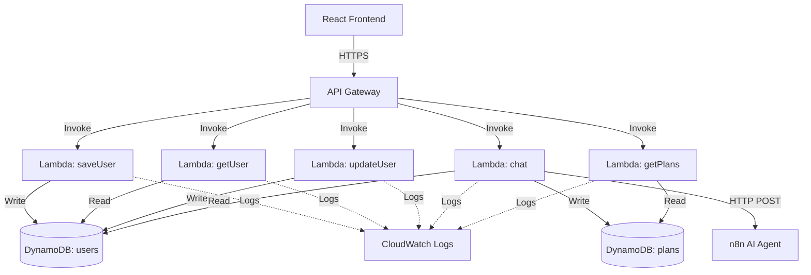

# Backend AWS Infrastructure - Design Document

## Overview

This document describes the design for a serverless AWS backend infrastructure for the SaveSmart application. The system uses API Gateway for HTTP endpoints, Lambda functions for business logic, and DynamoDB for data persistence. The architecture follows AWS best practices for serverless applications with a focus on scalability, cost-efficiency, and rapid deployment for the hackathon MVP.

The backend serves as the integration layer between the frontend React application and the n8n AI agent, managing user profiles, chat interactions, and savings plans.

## Architecture

### High-Level Architecture



### Component Responsibilities

**API Gateway (`savesmart-api`)**
- Exposes REST API endpoints to the frontend
- Handles CORS preflight requests
- Routes requests to appropriate Lambda functions
- Returns standardized HTTP responses

**Lambda Functions**
- `saveUser`: Creates new user profiles in DynamoDB
- `getUser`: Retrieves user profiles by userId
- `updateUser`: Updates existing user profiles
- `chat`: Orchestrates AI chat flow (fetch user → call n8n → save plan)
- `getPlans`: Retrieves saved savings plans for a user

**DynamoDB Tables**
- `savesmart-users`: Stores user profile data
- `savesmart-plans`: Stores AI-generated savings plans

**CloudWatch Logs**
- Captures all Lambda execution logs
- Enables debugging and monitoring

**n8n AI Agent (External)**
- Receives user context and chat messages
- Returns personalized financial advice
- Generates savings plans

### Request Flow Examples

**User Creation Flow:**
1. Frontend sends POST /users with profile data
2. API Gateway invokes saveUser Lambda
3. Lambda validates input and writes to DynamoDB users table
4. Lambda returns success response
5. API Gateway forwards response to frontend

**Chat Flow (Critical Path):**
1. Frontend sends POST /chat with userId and message
2. API Gateway invokes chat Lambda
3. Lambda fetches user profile from DynamoDB
4. Lambda sends user context + message to n8n webhook
5. n8n processes request and returns AI response
6. Lambda optionally saves plan to DynamoDB plans table
7. Lambda returns AI response to frontend

## Components and Interfaces

### API Gateway Configuration

**Resource Structure:**
```
/
├── /users
│   ├── POST (Create user)
│   ├── OPTIONS (CORS preflight)
│   └── /{userId}
│       ├── GET (Get user)
│       ├── PUT (Update user)
│       └── OPTIONS (CORS preflight)
├── /chat
│   ├── POST (Send message)
│   └── OPTIONS (CORS preflight)
└── /plans
    └── /{userId}
        ├── GET (Get plans)
        └── OPTIONS (CORS preflight)
```

**CORS Configuration:**
```json
{
  "Access-Control-Allow-Origin": "*",
  "Access-Control-Allow-Headers": "Content-Type,Authorization",
  "Access-Control-Allow-Methods": "GET,POST,PUT,OPTIONS"
}
```

**Integration Type:** Lambda Proxy Integration
- Passes entire request to Lambda (headers, body, query params)
- Lambda returns response in API Gateway format
- Simplifies Lambda code and reduces configuration

**Deployment Stage:** `prod`
- Single stage for MVP
- URL format: `https://{api-id}.execute-api.ap-southeast-2.amazonaws.com/prod`

### Lambda Function Interfaces

#### saveUser Lambda

**Input (API Gateway Event):**
```typescript
{
  body: string, // JSON stringified
  headers: { [key: string]: string },
  httpMethod: "POST",
  path: "/users"
}
```

**Parsed Body:**
```typescript
{
  userId: string,
  email: string,
  name: string,
  income: number,
  rent: number,
  groceryBudget: number,
  savings: number,
  hasCar: boolean,
  fuelType?: string,
  location: string,
  postcode?: string,
  dietaryPreferences: string[],
  subscriptions: string[]
}
```

**Output:**
```typescript
{
  statusCode: 200 | 400 | 500,
  headers: {
    "Access-Control-Allow-Origin": "*",
    "Content-Type": "application/json"
  },
  body: string // JSON stringified
}
```

**Success Response Body:**
```json
{
  "message": "User created successfully",
  "userId": "user-abc-123"
}
```

**Error Response Body:**
```json
{
  "error": "Missing required field: email",
  "code": "VALIDATION_ERROR",
  "statusCode": 400
}
```

#### getUser Lambda

**Input:**
```typescript
{
  pathParameters: {
    userId: string
  }
}
```

**Output (Success):**
```json
{
  "statusCode": 200,
  "body": "{\"userId\":\"user-abc-123\",\"email\":\"sarah@uni.edu.au\",...}"
}
```

**Output (Not Found):**
```json
{
  "statusCode": 404,
  "body": "{\"error\":\"User not found\",\"code\":\"USER_NOT_FOUND\"}"
}
```

#### updateUser Lambda

**Input:**
```typescript
{
  pathParameters: {
    userId: string
  },
  body: string // JSON with fields to update
}
```

**Parsed Body (Partial Update):**
```typescript
{
  income?: number,
  rent?: number,
  groceryBudget?: number,
  savings?: number,
  location?: string,
  // ... any user fields
}
```

**Output:**
```json
{
  "statusCode": 200,
  "body": "{\"message\":\"User updated successfully\"}"
}
```

#### chat Lambda (Most Complex)

**Input:**
```typescript
{
  body: string // JSON stringified
}
```

**Parsed Body:**
```typescript
{
  userId: string,
  message: string
}
```

**n8n Webhook Request:**
```typescript
{
  userId: string,
  message: string,
  userProfile: {
    userId: string,
    email: string,
    name: string,
    income: number,
    rent: number,
    groceryBudget: number,
    savings: number,
    hasCar: boolean,
    fuelType?: string,
    location: string,
    postcode?: string,
    dietaryPreferences: string[],
    subscriptions: string[]
  }
}
```

**n8n Webhook Response:**
```typescript
{
  reply: string, // AI's text response
  savings?: number, // Potential savings amount
  plan?: {
    goal: string,
    timeline: string,
    monthly: number,
    breakdown: Array<{
      category: string,
      amount: number,
      tip: string
    }>
  }
}
```

**Output:**
```json
{
  "statusCode": 200,
  "body": "{\"reply\":\"...\",\"savings\":150,\"plan\":{...}}"
}
```

#### getPlans Lambda

**Input:**
```typescript
{
  pathParameters: {
    userId: string
  }
}
```

**Output:**
```json
{
  "statusCode": 200,
  "body": "[{\"planId\":\"plan-123\",\"userId\":\"user-abc\",\"plan\":{...},\"createdAt\":\"...\"}]"
}
```

### Lambda Function Implementations

#### saveUser Implementation

```javascript
import { DynamoDBClient, PutItemCommand } from "@aws-sdk/client-dynamodb";
import { marshall } from "@aws-sdk/util-dynamodb";

const client = new DynamoDBClient({ region: "ap-southeast-2" });

export const handler = async (event) => {
  console.log("Received event:", JSON.stringify(event));

  try {
    // Parse and validate input
    const body = JSON.parse(event.body);
    const requiredFields = ["userId", "email", "name", "income", "rent", "groceryBudget", "savings", "location"];

    for (const field of requiredFields) {
      if (!body[field]) {
        return {
          statusCode: 400,
          headers: {
            "Access-Control-Allow-Origin": "*",
            "Content-Type": "application/json"
          },
          body: JSON.stringify({
            error: `Missing required field: ${field}`,
            code: "VALIDATION_ERROR",
            statusCode: 400
          })
        };
      }
    }

    // Prepare user object
    const user = {
      userId: body.userId,
      email: body.email,
      name: body.name,
      income: body.income,
      rent: body.rent,
      groceryBudget: body.groceryBudget,
      savings: body.savings,
      hasCar: body.hasCar || false,
      fuelType: body.fuelType || null,
      location: body.location,
      postcode: body.postcode || null,
      dietaryPreferences: body.dietaryPreferences || [],
      subscriptions: body.subscriptions || [],
      createdAt: new Date().toISOString()
    };

    // Write to DynamoDB
    await client.send(new PutItemCommand({
      TableName: "savesmart-users",
      Item: marshall(user)
    }));

    console.log("User created:", user.userId);

    return {
      statusCode: 200,
      headers: {
        "Access-Control-Allow-Origin": "*",
        "Content-Type": "application/json"
      },
      body: JSON.stringify({
        message: "User created successfully",
        userId: user.userId
      })
    };

  } catch (error) {
    console.error("Error creating user:", error);

    return {
      statusCode: 500,
      headers: {
        "Access-Control-Allow-Origin": "*",
        "Content-Type": "application/json"
      },
      body: JSON.stringify({
        error: "Internal server error",
        code: "INTERNAL_ERROR",
        statusCode: 500
      })
    };
  }
};
```

#### getUser Implementation

```javascript
import { DynamoDBClient, GetItemCommand } from "@aws-sdk/client-dynamodb";
import { unmarshall } from "@aws-sdk/util-dynamodb";

const client = new DynamoDBClient({ region: "ap-southeast-2" });

export const handler = async (event) => {
  console.log("Received event:", JSON.stringify(event));

  try {
    const userId = event.pathParameters?.userId;

    if (!userId) {
      return {
        statusCode: 400,
        headers: {
          "Access-Control-Allow-Origin": "*",
          "Content-Type": "application/json"
        },
        body: JSON.stringify({
          error: "Missing userId parameter",
          code: "VALIDATION_ERROR",
          statusCode: 400
        })
      };
    }

    // Fetch from DynamoDB
    const result = await client.send(new GetItemCommand({
      TableName: "savesmart-users",
      Key: {
        userId: { S: userId }
      }
    }));

    if (!result.Item) {
      return {
        statusCode: 404,
        headers: {
          "Access-Control-Allow-Origin": "*",
          "Content-Type": "application/json"
        },
        body: JSON.stringify({
          error: "User not found",
          code: "USER_NOT_FOUND",
          statusCode: 404
        })
      };
    }

    const user = unmarshall(result.Item);
    console.log("User retrieved:", userId);

    return {
      statusCode: 200,
      headers: {
        "Access-Control-Allow-Origin": "*",
        "Content-Type": "application/json"
      },
      body: JSON.stringify(user)
    };

  } catch (error) {
    console.error("Error retrieving user:", error);

    return {
      statusCode: 500,
      headers: {
        "Access-Control-Allow-Origin": "*",
        "Content-Type": "application/json"
      },
      body: JSON.stringify({
        error: "Internal server error",
        code: "INTERNAL_ERROR",
        statusCode: 500
      })
    };
  }
};
```

#### updateUser Implementation

```javascript
import { DynamoDBClient, UpdateItemCommand } from "@aws-sdk/client-dynamodb";

const client = new DynamoDBClient({ region: "ap-southeast-2" });

export const handler = async (event) => {
  console.log("Received event:", JSON.stringify(event));

  try {
    const userId = event.pathParameters?.userId;
    const body = JSON.parse(event.body);

    if (!userId) {
      return {
        statusCode: 400,
        headers: {
          "Access-Control-Allow-Origin": "*",
          "Content-Type": "application/json"
        },
        body: JSON.stringify({
          error: "Missing userId parameter",
          code: "VALIDATION_ERROR",
          statusCode: 400
        })
      };
    }

    // Build update expression dynamically
    const updateFields = [];
    const expressionAttributeNames = {};
    const expressionAttributeValues = {};

    const allowedFields = [
      "email", "name", "income", "rent", "groceryBudget", "savings",
      "hasCar", "fuelType", "location", "postcode", "dietaryPreferences", "subscriptions"
    ];

    for (const field of allowedFields) {
      if (body[field] !== undefined) {
        updateFields.push(`#${field} = :${field}`);
        expressionAttributeNames[`#${field}`] = field;

        // Handle different data types
        if (typeof body[field] === "number") {
          expressionAttributeValues[`:${field}`] = { N: String(body[field]) };
        } else if (typeof body[field] === "boolean") {
          expressionAttributeValues[`:${field}`] = { BOOL: body[field] };
        } else if (Array.isArray(body[field])) {
          expressionAttributeValues[`:${field}`] = { L: body[field].map(v => ({ S: v })) };
        } else if (body[field] === null) {
          expressionAttributeValues[`:${field}`] = { NULL: true };
        } else {
          expressionAttributeValues[`:${field}`] = { S: String(body[field]) };
        }
      }
    }

    if (updateFields.length === 0) {
      return {
        statusCode: 400,
        headers: {
          "Access-Control-Allow-Origin": "*",
          "Content-Type": "application/json"
        },
        body: JSON.stringify({
          error: "No valid fields to update",
          code: "VALIDATION_ERROR",
          statusCode: 400
        })
      };
    }

    // Update DynamoDB
    await client.send(new UpdateItemCommand({
      TableName: "savesmart-users",
      Key: {
        userId: { S: userId }
      },
      UpdateExpression: `SET ${updateFields.join(", ")}`,
      ExpressionAttributeNames: expressionAttributeNames,
      ExpressionAttributeValues: expressionAttributeValues
    }));

    console.log("User updated:", userId);

    return {
      statusCode: 200,
      headers: {
        "Access-Control-Allow-Origin": "*",
        "Content-Type": "application/json"
      },
      body: JSON.stringify({
        message: "User updated successfully"
      })
    };

  } catch (error) {
    console.error("Error updating user:", error);

    return {
      statusCode: 500,
      headers: {
        "Access-Control-Allow-Origin": "*",
        "Content-Type": "application/json"
      },
      body: JSON.stringify({
        error: "Internal server error",
        code: "INTERNAL_ERROR",
        statusCode: 500
      })
    };
  }
};
```

#### chat Implementation (Critical)

```javascript
import { DynamoDBClient, GetItemCommand, PutItemCommand } from "@aws-sdk/client-dynamodb";
import { unmarshall, marshall } from "@aws-sdk/util-dynamodb";

const client = new DynamoDBClient({ region: "ap-southeast-2" });
const N8N_WEBHOOK_URL = process.env.N8N_WEBHOOK_URL;

export const handler = async (event) => {
  console.log("Received event:", JSON.stringify(event));

  try {
    // Parse input
    const body = JSON.parse(event.body);
    const { userId, message } = body;

    if (!userId || !message) {
      return {
        statusCode: 400,
        headers: {
          "Access-Control-Allow-Origin": "*",
          "Content-Type": "application/json"
        },
        body: JSON.stringify({
          error: "Missing required fields: userId and message",
          code: "VALIDATION_ERROR",
          statusCode: 400
        })
      };
    }

    // Step 1: Fetch user profile from DynamoDB
    console.log("Fetching user profile:", userId);
    const userResult = await client.send(new GetItemCommand({
      TableName: "savesmart-users",
      Key: {
        userId: { S: userId }
      }
    }));

    if (!userResult.Item) {
      return {
        statusCode: 404,
        headers: {
          "Access-Control-Allow-Origin": "*",
          "Content-Type": "application/json"
        },
        body: JSON.stringify({
          error: "User not found",
          code: "USER_NOT_FOUND",
          statusCode: 404
        })
      };
    }

    const userProfile = unmarshall(userResult.Item);
    console.log("User profile retrieved");

    // Step 2: Send to n8n webhook with user context
    console.log("Calling n8n webhook:", N8N_WEBHOOK_URL);
    const n8nResponse = await fetch(N8N_WEBHOOK_URL, {
      method: "POST",
      headers: {
        "Content-Type": "application/json"
      },
      body: JSON.stringify({
        userId: userId,
        message: message,
        userProfile: userProfile
      })
    });

    if (!n8nResponse.ok) {
      console.error("n8n webhook error:", n8nResponse.status, n8nResponse.statusText);
      return {
        statusCode: 502,
        headers: {
          "Access-Control-Allow-Origin": "*",
          "Content-Type": "application/json"
        },
        body: JSON.stringify({
          error: "AI agent unavailable",
          code: "AI_AGENT_ERROR",
          statusCode: 502
        })
      };
    }

    const agentResponse = await n8nResponse.json();
    console.log("n8n response received");

    // Step 3: Optionally save plan to DynamoDB
    if (agentResponse.plan) {
      console.log("Saving plan to DynamoDB");
      const planId = `plan-${Date.now()}`;

      await client.send(new PutItemCommand({
        TableName: "savesmart-plans",
        Item: marshall({
          planId: planId,
          userId: userId,
          plan: agentResponse.plan,
          createdAt: new Date().toISOString()
        })
      }));

      console.log("Plan saved:", planId);
    }

    // Step 4: Return response to frontend
    return {
      statusCode: 200,
      headers: {
        "Access-Control-Allow-Origin": "*",
        "Content-Type": "application/json"
      },
      body: JSON.stringify({
        reply: agentResponse.reply,
        savings: agentResponse.savings || null,
        plan: agentResponse.plan || null
      })
    };

  } catch (error) {
    console.error("Error in chat handler:", error);

    return {
      statusCode: 500,
      headers: {
        "Access-Control-Allow-Origin": "*",
        "Content-Type": "application/json"
      },
      body: JSON.stringify({
        error: "Internal server error",
        code: "INTERNAL_ERROR",
        statusCode: 500,
        details: error.message
      })
    };
  }
};
```

#### getPlans Implementation

```javascript
import { DynamoDBClient, QueryCommand } from "@aws-sdk/client-dynamodb";
import { unmarshall } from "@aws-sdk/util-dynamodb";

const client = new DynamoDBClient({ region: "ap-southeast-2" });

export const handler = async (event) => {
  console.log("Received event:", JSON.stringify(event));

  try {
    const userId = event.pathParameters?.userId;

    if (!userId) {
      return {
        statusCode: 400,
        headers: {
          "Access-Control-Allow-Origin": "*",
          "Content-Type": "application/json"
        },
        body: JSON.stringify({
          error: "Missing userId parameter",
          code: "VALIDATION_ERROR",
          statusCode: 400
        })
      };
    }

    // Query plans by userId (GSI required or scan with filter)
    // For MVP, we'll use a scan with filter (not optimal but simple)
    const result = await client.send(new QueryCommand({
      TableName: "savesmart-plans",
      IndexName: "userId-index", // Assumes GSI exists
      KeyConditionExpression: "userId = :userId",
      ExpressionAttributeValues: {
        ":userId": { S: userId }
      },
      ScanIndexForward: false // Most recent first
    }));

    const plans = result.Items ? result.Items.map(item => unmarshall(item)) : [];
    console.log(`Retrieved ${plans.length} plans for user:`, userId);

    return {
      statusCode: 200,
      headers: {
        "Access-Control-Allow-Origin": "*",
        "Content-Type": "application/json"
      },
      body: JSON.stringify(plans)
    };

  } catch (error) {
    console.error("Error retrieving plans:", error);

    // If GSI doesn't exist, fall back to scan
    if (error.name === "ValidationException") {
      console.log("GSI not found, falling back to scan");
      // Implement scan fallback here if needed
    }

    return {
      statusCode: 500,
      headers: {
        "Access-Control-Allow-Origin": "*",
        "Content-Type": "application/json"
      },
      body: JSON.stringify({
        error: "Internal server error",
        code: "INTERNAL_ERROR",
        statusCode: 500
      })
    };
  }
};
```

## Data Models

### DynamoDB Table Schemas

#### savesmart-users Table

**Table Configuration:**
- Table Name: `savesmart-users`
- Partition Key: `userId` (String)
- Billing Mode: On-Demand (pay per request)
- Encryption: AWS managed keys
- Point-in-time recovery: Disabled (MVP)

**Item Schema:**
```typescript
{
  userId: string,           // Partition key, format: "user-{uuid}" or "demo-{name}-{id}"
  email: string,            // User's email address
  name: string,             // User's display name
  income: number,           // Monthly income in AUD
  rent: number,             // Monthly rent in AUD
  groceryBudget: number,    // Weekly grocery budget in AUD
  savings: number,          // Current savings in AUD
  hasCar: boolean,          // Whether user owns a car
  fuelType: string | null,  // "E10", "Unleaded 91", "Diesel", etc.
  location: string,         // Suburb name
  postcode: string | null,  // Australian postcode
  dietaryPreferences: string[], // ["vegetarian", "vegan", "halal", etc.]
  subscriptions: string[],  // ["Netflix", "Spotify", "Gym", etc.]
  createdAt: string         // ISO 8601 timestamp
}
```

**Example Item:**
```json
{
  "userId": "demo-sarah-123",
  "email": "sarah@uni.edu.au",
  "name": "Sarah",
  "income": 1200,
  "rent": 600,
  "groceryBudget": 80,
  "savings": 500,
  "hasCar": true,
  "fuelType": "E10",
  "location": "Parramatta",
  "postcode": "2150",
  "dietaryPreferences": ["vegetarian"],
  "subscriptions": ["Netflix", "Spotify"],
  "createdAt": "2026-02-11T10:00:00Z"
}
```

**Access Patterns:**
1. Get user by userId (GetItem) - O(1)
2. Create user (PutItem) - O(1)
3. Update user fields (UpdateItem) - O(1)

**Indexes:** None required for MVP

#### savesmart-plans Table

**Table Configuration:**
- Table Name: `savesmart-plans`
- Partition Key: `planId` (String)
- Sort Key: `userId` (String)
- Billing Mode: On-Demand
- Encryption: AWS managed keys
- Point-in-time recovery: Disabled (MVP)

**Alternative Design (Recommended):**
- Partition Key: `userId` (String)
- Sort Key: `planId` (String)
- This allows efficient querying of all plans for a user

**Item Schema:**
```typescript
{
  planId: string,           // Partition key, format: "plan-{timestamp}"
  userId: string,           // Sort key, links to user
  plan: {
    goal: string,           // e.g., "Save $3000 for Japan trip"
    timeline: string,       // e.g., "6 months"
    monthly: number,        // Monthly savings target
    breakdown: Array<{
      category: string,     // e.g., "Groceries", "Transport"
      amount: number,       // Savings amount
      tip: string           // Actionable advice
    }>
  },
  createdAt: string         // ISO 8601 timestamp
}
```

**Example Item:**
```json
{
  "planId": "plan-1707649200000",
  "userId": "demo-sarah-123",
  "plan": {
    "goal": "Save $3000 for Japan trip",
    "timeline": "6 months",
    "monthly": 500,
    "breakdown": [
      {
        "category": "Groceries",
        "amount": 150,
        "tip": "Shop at ALDI instead of Coles for 30% savings"
      },
      {
        "category": "Transport",
        "amount": 200,
        "tip": "Use Opal card off-peak for 30% discount"
      },
      {
        "category": "Subscriptions",
        "amount": 150,
        "tip": "Cancel unused Netflix and Spotify, use free alternatives"
      }
    ]
  },
  "createdAt": "2026-02-11T10:30:00Z"
}
```

**Access Patterns:**
1. Save new plan (PutItem) - O(1)
2. Get all plans for user (Query on userId) - O(n) where n = number of user's plans
3. Get specific plan (GetItem with planId + userId) - O(1)

**Indexes:**
- GSI: `userId-index` (Partition Key: userId, Sort Key: createdAt)
- Enables efficient querying of user's plans sorted by date

### Data Validation Rules

**User Profile Validation:**
- `userId`: Required, non-empty string
- `email`: Required, valid email format
- `name`: Required, non-empty string
- `income`: Required, positive number
- `rent`: Required, non-negative number
- `groceryBudget`: Required, positive number
- `savings`: Required, non-negative number
- `hasCar`: Optional, boolean (default: false)
- `fuelType`: Optional, string or null
- `location`: Required, non-empty string
- `postcode`: Optional, 4-digit Australian postcode
- `dietaryPreferences`: Optional, array of strings (default: [])
- `subscriptions`: Optional, array of strings (default: [])

**Plan Validation:**
- `userId`: Required, must match existing user
- `plan.goal`: Required, non-empty string
- `plan.timeline`: Required, non-empty string
- `plan.monthly`: Required, positive number
- `plan.breakdown`: Required, non-empty array

## Correctness Properties

*A property is a characteristic or behavior that should hold true across all valid executions of a system—essentially, a formal statement about what the system should do. Properties serve as the bridge between human-readable specifications and machine-verifiable correctness guarantees.*

### Property 1: User Creation Round-Trip

*For any* valid user profile data, creating a user via POST /users and then retrieving that user via GET /users/{userId} should return the same user data.

**Validates: Requirements 3.3.1, 3.3.2**

### Property 2: Non-Existent User Returns 404

*For any* userId that has not been created, attempting to retrieve that user via GET /users/{userId} should return a 404 status code with error code "USER_NOT_FOUND".

**Validates: Requirements 3.3.2**

### Property 3: User Update Consistency

*For any* existing user and any valid partial update, updating the user via PUT /users/{userId} and then retrieving the user should reflect all updated fields while preserving unchanged fields.

**Validates: Requirements 3.3.3**

### Property 4: Chat Response Structure

*For any* valid userId and message, the POST /chat endpoint should return a response containing a "reply" field, and if a "plan" field is present in the response, it should have the required structure (goal, timeline, monthly, breakdown).

**Validates: Requirements 3.3.4**

### Property 5: Plan Persistence and Retrieval

*For any* user, if the chat endpoint returns a plan and saves it to DynamoDB, then retrieving plans via GET /plans/{userId} should include that plan with matching userId and plan data.

**Validates: Requirements 3.3.4, 3.3.5**

### Property 6: Standardized Error Format

*For any* Lambda function endpoint, when provided with invalid input (missing required parameters), the response should have a 400 status code and body containing "error", "code", and "statusCode" fields.

**Validates: Requirements 3.6**


## Error Handling

### Error Response Format

All Lambda functions return errors in a standardized format:

```json
{
  "error": "Human-readable error message",
  "code": "ERROR_CODE_CONSTANT",
  "statusCode": 400 | 404 | 500 | 502
}
```

### Error Categories

**Validation Errors (400):**
- Missing required parameters
- Invalid data types
- Invalid email format
- Invalid postcode format
- Code: `VALIDATION_ERROR`

**Not Found Errors (404):**
- User does not exist
- Plan does not exist
- Code: `USER_NOT_FOUND`, `PLAN_NOT_FOUND`

**External Service Errors (502):**
- n8n webhook unavailable
- n8n webhook timeout
- n8n webhook returns error
- Code: `AI_AGENT_ERROR`

**Internal Errors (500):**
- DynamoDB operation failures
- Unexpected exceptions
- JSON parsing errors
- Code: `INTERNAL_ERROR`

### Error Handling Strategies

**Input Validation:**
```javascript
// Validate required fields
const requiredFields = ["userId", "email", "name"];
for (const field of requiredFields) {
  if (!body[field]) {
    return errorResponse(400, `Missing required field: ${field}`, "VALIDATION_ERROR");
  }
}

// Validate data types
if (typeof body.income !== "number" || body.income <= 0) {
  return errorResponse(400, "Income must be a positive number", "VALIDATION_ERROR");
}
```

**DynamoDB Error Handling:**
```javascript
try {
  await client.send(new PutItemCommand({...}));
} catch (error) {
  console.error("DynamoDB error:", error);

  if (error.name === "ConditionalCheckFailedException") {
    return errorResponse(409, "User already exists", "DUPLICATE_USER");
  }

  return errorResponse(500, "Database operation failed", "INTERNAL_ERROR");
}
```

**n8n Webhook Error Handling:**
```javascript
try {
  const response = await fetch(N8N_WEBHOOK_URL, {
    method: "POST",
    headers: { "Content-Type": "application/json" },
    body: JSON.stringify(payload),
    signal: AbortSignal.timeout(55000) // 55 second timeout
  });

  if (!response.ok) {
    console.error("n8n error:", response.status, response.statusText);
    return errorResponse(502, "AI agent unavailable", "AI_AGENT_ERROR");
  }

  return await response.json();

} catch (error) {
  if (error.name === "AbortError") {
    return errorResponse(504, "AI agent timeout", "AI_AGENT_TIMEOUT");
  }

  return errorResponse(502, "AI agent error", "AI_AGENT_ERROR");
}
```

**Logging Strategy:**
```javascript
// Log all incoming requests
console.log("Received event:", JSON.stringify(event));

// Log key operations
console.log("Fetching user profile:", userId);
console.log("Calling n8n webhook:", N8N_WEBHOOK_URL);
console.log("Saving plan to DynamoDB");

// Log all errors with context
console.error("Error in chat handler:", error);
console.error("DynamoDB error:", error.name, error.message);
console.error("n8n webhook error:", response.status, response.statusText);
```

### CORS Error Handling

All error responses MUST include CORS headers:

```javascript
{
  statusCode: 400,
  headers: {
    "Access-Control-Allow-Origin": "*",
    "Content-Type": "application/json"
  },
  body: JSON.stringify({ error: "...", code: "...", statusCode: 400 })
}
```

Without CORS headers, the browser will block error responses, making debugging difficult.

## IAM Roles and Permissions

### Lambda Execution Roles

Each Lambda function requires an execution role with the following policies:

**Base Policy (All Lambdas):**
```json
{
  "Version": "2012-10-17",
  "Statement": [
    {
      "Effect": "Allow",
      "Action": [
        "logs:CreateLogGroup",
        "logs:CreateLogStream",
        "logs:PutLogEvents"
      ],
      "Resource": "arn:aws:logs:ap-southeast-2:*:*"
    }
  ]
}
```

**DynamoDB Read Policy (getUser, chat, getPlans):**
```json
{
  "Version": "2012-10-17",
  "Statement": [
    {
      "Effect": "Allow",
      "Action": [
        "dynamodb:GetItem",
        "dynamodb:Query"
      ],
      "Resource": [
        "arn:aws:dynamodb:ap-southeast-2:*:table/savesmart-users",
        "arn:aws:dynamodb:ap-southeast-2:*:table/savesmart-plans",
        "arn:aws:dynamodb:ap-southeast-2:*:table/savesmart-plans/index/*"
      ]
    }
  ]
}
```

**DynamoDB Write Policy (saveUser, updateUser, chat):**
```json
{
  "Version": "2012-10-17",
  "Statement": [
    {
      "Effect": "Allow",
      "Action": [
        "dynamodb:PutItem",
        "dynamodb:UpdateItem"
      ],
      "Resource": [
        "arn:aws:dynamodb:ap-southeast-2:*:table/savesmart-users",
        "arn:aws:dynamodb:ap-southeast-2:*:table/savesmart-plans"
      ]
    }
  ]
}
```

### Role Assignment

| Lambda Function | CloudWatch Logs | DynamoDB Read | DynamoDB Write |
|----------------|-----------------|---------------|----------------|
| saveUser       | ✓               | -             | ✓              |
| getUser        | ✓               | ✓             | -              |
| updateUser     | ✓               | -             | ✓              |
| chat           | ✓               | ✓             | ✓              |
| getPlans       | ✓               | ✓             | -              |

### Security Considerations

**For MVP (Hackathon):**
- No authentication required
- CORS allows all origins (*)
- DynamoDB tables are not encrypted at rest (AWS managed keys only)
- No VPC configuration
- No API Gateway API keys

**For Production (Future):**
- Add JWT authentication via API Gateway authorizer
- Restrict CORS to specific frontend domain
- Enable DynamoDB encryption with customer-managed keys
- Deploy Lambdas in VPC for network isolation
- Add API Gateway usage plans and API keys
- Implement rate limiting
- Add WAF rules for DDoS protection

## Testing Strategy

### Dual Testing Approach

The backend infrastructure requires both unit tests and property-based tests for comprehensive coverage:

**Unit Tests:**
- Test specific examples and edge cases
- Test error conditions with specific inputs
- Test integration points between components
- Validate response formats and status codes

**Property-Based Tests:**
- Verify universal properties across all inputs
- Test data consistency (round-trip properties)
- Validate error handling across random invalid inputs
- Ensure CORS headers present in all responses

### Property-Based Testing Configuration

**Testing Library:** Use `fast-check` for JavaScript/Node.js property-based testing

**Test Configuration:**
- Minimum 100 iterations per property test
- Each test references its design document property
- Tag format: `Feature: backend-aws-infrastructure, Property {number}: {property_text}`

**Example Property Test:**
```javascript
import fc from 'fast-check';
import { handler as saveUser } from './saveUser.js';
import { handler as getUser } from './getUser.js';

// Feature: backend-aws-infrastructure, Property 1: User Creation Round-Trip
test('Property 1: User creation round-trip', async () => {
  await fc.assert(
    fc.asyncProperty(
      fc.record({
        userId: fc.string({ minLength: 1 }),
        email: fc.emailAddress(),
        name: fc.string({ minLength: 1 }),
        income: fc.integer({ min: 1, max: 100000 }),
        rent: fc.integer({ min: 0, max: 50000 }),
        groceryBudget: fc.integer({ min: 1, max: 1000 }),
        savings: fc.integer({ min: 0, max: 1000000 }),
        hasCar: fc.boolean(),
        location: fc.string({ minLength: 1 }),
        dietaryPreferences: fc.array(fc.string()),
        subscriptions: fc.array(fc.string())
      }),
      async (userData) => {
        // Create user
        const createEvent = {
          body: JSON.stringify(userData),
          httpMethod: 'POST',
          path: '/users'
        };
        const createResponse = await saveUser(createEvent);
        expect(createResponse.statusCode).toBe(200);

        // Retrieve user
        const getEvent = {
          pathParameters: { userId: userData.userId },
          httpMethod: 'GET',
          path: `/users/${userData.userId}`
        };
        const getResponse = await getUser(getEvent);
        expect(getResponse.statusCode).toBe(200);

        const retrievedUser = JSON.parse(getResponse.body);

        // Verify all fields match
        expect(retrievedUser.userId).toBe(userData.userId);
        expect(retrievedUser.email).toBe(userData.email);
        expect(retrievedUser.name).toBe(userData.name);
        expect(retrievedUser.income).toBe(userData.income);
        // ... verify all fields
      }
    ),
    { numRuns: 100 }
  );
});
```

### Unit Test Examples

**Test POST /users with valid data:**
```javascript
test('Create user with valid data', async () => {
  const event = {
    body: JSON.stringify({
      userId: 'test-user-123',
      email: 'test@example.com',
      name: 'Test User',
      income: 5000,
      rent: 2000,
      groceryBudget: 200,
      savings: 10000,
      hasCar: true,
      location: 'Sydney',
      dietaryPreferences: [],
      subscriptions: []
    })
  };

  const response = await saveUser(event);

  expect(response.statusCode).toBe(200);
  expect(JSON.parse(response.body).message).toBe('User created successfully');
});
```

**Test GET /users/{userId} with invalid userId:**
```javascript
test('Get non-existent user returns 404', async () => {
  const event = {
    pathParameters: { userId: 'non-existent-user' }
  };

  const response = await getUser(event);

  expect(response.statusCode).toBe(404);
  const body = JSON.parse(response.body);
  expect(body.error).toBe('User not found');
  expect(body.code).toBe('USER_NOT_FOUND');
});
```

**Test POST /chat with missing parameters:**
```javascript
test('Chat with missing userId returns 400', async () => {
  const event = {
    body: JSON.stringify({ message: 'Hello' })
  };

  const response = await chat(event);

  expect(response.statusCode).toBe(400);
  const body = JSON.parse(response.body);
  expect(body.code).toBe('VALIDATION_ERROR');
});
```

### Integration Testing

**End-to-End Flow Test:**
1. Create user via POST /users
2. Verify user exists via GET /users/{userId}
3. Send chat message via POST /chat
4. Verify plan saved via GET /plans/{userId}
5. Update user via PUT /users/{userId}
6. Verify updates via GET /users/{userId}

**CORS Testing:**
- Verify all responses include `Access-Control-Allow-Origin: *`
- Verify OPTIONS requests return 200 with CORS headers
- Test from browser to ensure no CORS errors

**n8n Integration Testing:**
- Mock n8n webhook responses
- Test timeout handling (55+ second responses)
- Test error responses from n8n
- Test plan saving when n8n returns plan data

## Performance Considerations

### Lambda Configuration

**Memory Allocation:**
- saveUser, getUser, updateUser, getPlans: 128 MB (sufficient for simple DynamoDB operations)
- chat: 256 MB (handles HTTP requests to n8n and JSON processing)

**Timeout Configuration:**
- saveUser, getUser, updateUser, getPlans: 10 seconds
- chat: 60 seconds (n8n AI processing can take 30-50 seconds)

**Cold Start Optimization:**
- Use ES modules for faster initialization
- Minimize dependencies (use AWS SDK v3 with modular imports)
- Keep Lambda package size < 10 MB
- Expected cold start: < 3 seconds

**Warm Execution:**
- DynamoDB operations: < 100ms
- Simple Lambda logic: < 50ms
- Total warm execution: < 500ms (excluding n8n)

### DynamoDB Performance

**On-Demand Billing:**
- Automatically scales with traffic
- No capacity planning required
- Pay per request (ideal for hackathon with unpredictable traffic)

**Read Performance:**
- GetItem: < 10ms average
- Query (with GSI): < 50ms average
- Consistent reads not required for MVP

**Write Performance:**
- PutItem: < 20ms average
- UpdateItem: < 30ms average

**Optimization Strategies:**
- Use batch operations if creating multiple items (not needed for MVP)
- Use projection expressions to fetch only required fields (optimization for future)
- Consider caching user profiles in Lambda memory for repeated chat requests (future optimization)

### API Gateway Performance

**Request Handling:**
- API Gateway adds < 50ms latency
- Supports up to 10,000 requests per second (default limit)
- No throttling expected for hackathon demo

**Response Size Limits:**
- Maximum payload: 10 MB (sufficient for all responses)
- Typical response sizes: < 10 KB

### n8n Integration Performance

**Expected Response Times:**
- Simple queries: 5-10 seconds
- Complex AI processing: 30-50 seconds
- Timeout configured: 55 seconds (leaves 5 second buffer)

**Optimization Strategies:**
- Use streaming responses (future enhancement)
- Implement caching for common queries (future enhancement)
- Add loading indicators in frontend for long-running requests

### Monitoring and Alerts

**CloudWatch Metrics:**
- Lambda invocation count
- Lambda error count
- Lambda duration (p50, p95, p99)
- DynamoDB consumed read/write capacity
- API Gateway 4xx and 5xx errors

**Recommended Alarms (Future):**
- Lambda error rate > 5%
- Lambda duration > 50 seconds
- DynamoDB throttling events
- API Gateway 5xx rate > 1%

## Deployment Considerations

### Infrastructure as Code

**Recommended Approach:** Use AWS SAM or Terraform for infrastructure deployment

**SAM Template Structure:**
```yaml
AWSTemplateFormatVersion: '2010-09-09'
Transform: AWS::Serverless-2016-10-31

Resources:
  SaveSmartUsersTable:
    Type: AWS::DynamoDB::Table
    Properties:
      TableName: savesmart-users
      BillingMode: PAY_PER_REQUEST
      AttributeDefinitions:
        - AttributeName: userId
          AttributeType: S
      KeySchema:
        - AttributeName: userId
          KeyType: HASH

  SaveSmartPlansTable:
    Type: AWS::DynamoDB::Table
    Properties:
      TableName: savesmart-plans
      BillingMode: PAY_PER_REQUEST
      AttributeDefinitions:
        - AttributeName: userId
          AttributeType: S
        - AttributeName: planId
          AttributeType: S
      KeySchema:
        - AttributeName: userId
          KeyType: HASH
        - AttributeName: planId
          KeyType: RANGE
      GlobalSecondaryIndexes:
        - IndexName: userId-index
          KeySchema:
            - AttributeName: userId
              KeyType: HASH
          Projection:
            ProjectionType: ALL

  SaveUserFunction:
    Type: AWS::Serverless::Function
    Properties:
      FunctionName: savesmart-saveUser
      Runtime: nodejs20.x
      Handler: saveUser.handler
      Timeout: 10
      MemorySize: 128
      Policies:
        - DynamoDBCrudPolicy:
            TableName: !Ref SaveSmartUsersTable
      Events:
        CreateUser:
          Type: Api
          Properties:
            Path: /users
            Method: POST
            RestApiId: !Ref SaveSmartApi

  # ... other Lambda functions

  SaveSmartApi:
    Type: AWS::Serverless::Api
    Properties:
      Name: savesmart-api
      StageName: prod
      Cors:
        AllowOrigin: "'*'"
        AllowHeaders: "'Content-Type,Authorization'"
        AllowMethods: "'GET,POST,PUT,OPTIONS'"
```

### Environment Variables

**chat Lambda:**
- `N8N_WEBHOOK_URL`: URL of the n8n webhook endpoint
- Set via AWS Console or SAM template

**Example:**
```yaml
Environment:
  Variables:
    N8N_WEBHOOK_URL: https://n8n.example.com/webhook/savesmart-chat
```

### Deployment Steps

1. Create DynamoDB tables
2. Deploy Lambda functions with IAM roles
3. Create API Gateway REST API
4. Configure API Gateway integrations
5. Deploy API to `prod` stage
6. Set environment variables
7. Test all endpoints
8. Share API Gateway URL with frontend team

### Demo Data Setup

**Create Sarah's Demo Account:**
```bash
aws dynamodb put-item \
  --table-name savesmart-users \
  --item '{
    "userId": {"S": "demo-sarah-123"},
    "email": {"S": "sarah@uni.edu.au"},
    "name": {"S": "Sarah"},
    "income": {"N": "1200"},
    "rent": {"N": "600"},
    "groceryBudget": {"N": "80"},
    "savings": {"N": "500"},
    "hasCar": {"BOOL": true},
    "fuelType": {"S": "E10"},
    "location": {"S": "Parramatta"},
    "postcode": {"S": "2150"},
    "dietaryPreferences": {"L": [{"S": "vegetarian"}]},
    "subscriptions": {"L": [{"S": "Netflix"}, {"S": "Spotify"}]},
    "createdAt": {"S": "2026-02-11T10:00:00Z"}
  }'
```

## Integration with n8n AI Agent

### Webhook Contract

**Request Format (Lambda → n8n):**
```json
{
  "userId": "demo-sarah-123",
  "message": "How can I save money on groceries?",
  "userProfile": {
    "userId": "demo-sarah-123",
    "email": "sarah@uni.edu.au",
    "name": "Sarah",
    "income": 1200,
    "rent": 600,
    "groceryBudget": 80,
    "savings": 500,
    "hasCar": true,
    "fuelType": "E10",
    "location": "Parramatta",
    "postcode": "2150",
    "dietaryPreferences": ["vegetarian"],
    "subscriptions": ["Netflix", "Spotify"]
  }
}
```

**Response Format (n8n → Lambda):**
```json
{
  "reply": "Based on your vegetarian diet and Parramatta location, here are some tips...",
  "savings": 150,
  "plan": {
    "goal": "Save $150/month on groceries",
    "timeline": "Immediate",
    "monthly": 150,
    "breakdown": [
      {
        "category": "Groceries",
        "amount": 150,
        "tip": "Shop at ALDI Parramatta for 30% savings on vegetarian products"
      }
    ]
  }
}
```

### Error Handling

**n8n Timeout:**
- Lambda timeout: 60 seconds
- Fetch timeout: 55 seconds
- If n8n doesn't respond in 55 seconds, return 504 error

**n8n Error Response:**
- If n8n returns non-200 status, return 502 error
- Log n8n error details to CloudWatch

**n8n Unavailable:**
- If n8n webhook URL is unreachable, return 502 error
- Frontend should display user-friendly error message

### Testing Without n8n

**Mock n8n Response:**
```javascript
// For local testing, use mock response
const MOCK_N8N_RESPONSE = {
  reply: "This is a mock response for testing",
  savings: 100,
  plan: {
    goal: "Test savings plan",
    timeline: "1 month",
    monthly: 100,
    breakdown: [
      {
        category: "Test",
        amount: 100,
        tip: "This is a test tip"
      }
    ]
  }
};

// In chat Lambda, add environment variable check
if (process.env.USE_MOCK_N8N === 'true') {
  const agentResponse = MOCK_N8N_RESPONSE;
} else {
  const n8nResponse = await fetch(N8N_WEBHOOK_URL, {...});
  const agentResponse = await n8nResponse.json();
}
```

## API Documentation

### Base URL

```
https://{api-id}.execute-api.ap-southeast-2.amazonaws.com/prod
```

Replace `{api-id}` with the actual API Gateway ID after deployment.

### Endpoints

#### POST /users

Create a new user profile.

**Request:**
```http
POST /users
Content-Type: application/json

{
  "userId": "user-abc-123",
  "email": "sarah@uni.edu.au",
  "name": "Sarah",
  "income": 1200,
  "rent": 600,
  "groceryBudget": 80,
  "savings": 500,
  "hasCar": true,
  "fuelType": "E10",
  "location": "Parramatta",
  "postcode": "2150",
  "dietaryPreferences": ["vegetarian"],
  "subscriptions": ["Netflix", "Spotify"]
}
```

**Response (200):**
```json
{
  "message": "User created successfully",
  "userId": "user-abc-123"
}
```

#### GET /users/{userId}

Retrieve a user profile.

**Request:**
```http
GET /users/demo-sarah-123
```

**Response (200):**
```json
{
  "userId": "demo-sarah-123",
  "email": "sarah@uni.edu.au",
  "name": "Sarah",
  "income": 1200,
  "rent": 600,
  "groceryBudget": 80,
  "savings": 500,
  "hasCar": true,
  "fuelType": "E10",
  "location": "Parramatta",
  "postcode": "2150",
  "dietaryPreferences": ["vegetarian"],
  "subscriptions": ["Netflix", "Spotify"],
  "createdAt": "2026-02-11T10:00:00Z"
}
```

**Response (404):**
```json
{
  "error": "User not found",
  "code": "USER_NOT_FOUND",
  "statusCode": 404
}
```

#### PUT /users/{userId}

Update a user profile.

**Request:**
```http
PUT /users/demo-sarah-123
Content-Type: application/json

{
  "income": 1500,
  "savings": 800
}
```

**Response (200):**
```json
{
  "message": "User updated successfully"
}
```

#### POST /chat

Send a message to the AI agent.

**Request:**
```http
POST /chat
Content-Type: application/json

{
  "userId": "demo-sarah-123",
  "message": "How can I save money on groceries?"
}
```

**Response (200):**
```json
{
  "reply": "Based on your vegetarian diet and Parramatta location, here are some tips...",
  "savings": 150,
  "plan": {
    "goal": "Save $150/month on groceries",
    "timeline": "Immediate",
    "monthly": 150,
    "breakdown": [
      {
        "category": "Groceries",
        "amount": 150,
        "tip": "Shop at ALDI Parramatta for 30% savings"
      }
    ]
  }
}
```

#### GET /plans/{userId}

Retrieve saved plans for a user.

**Request:**
```http
GET /plans/demo-sarah-123
```

**Response (200):**
```json
[
  {
    "planId": "plan-1707649200000",
    "userId": "demo-sarah-123",
    "plan": {
      "goal": "Save $3000 for Japan trip",
      "timeline": "6 months",
      "monthly": 500,
      "breakdown": [...]
    },
    "createdAt": "2026-02-11T10:30:00Z"
  }
]
```

## Summary

This design provides a complete serverless backend infrastructure for the SaveSmart application using AWS services. The architecture is optimized for rapid deployment, cost-efficiency, and scalability, making it ideal for the hackathon MVP while maintaining a clear path for production enhancements.

Key design decisions:
- Serverless architecture for automatic scaling and minimal operational overhead
- On-demand DynamoDB billing for unpredictable traffic patterns
- Lambda proxy integration for simplified API Gateway configuration
- Comprehensive error handling with standardized response formats
- Property-based testing for robust correctness validation
- Clear separation of concerns between Lambda functions
- Detailed logging for debugging and monitoring

The design addresses all requirements while maintaining flexibility for future enhancements such as authentication, rate limiting, and multi-region deployment.
